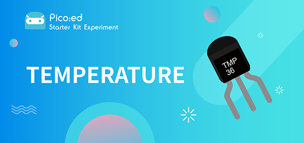
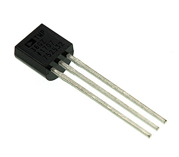
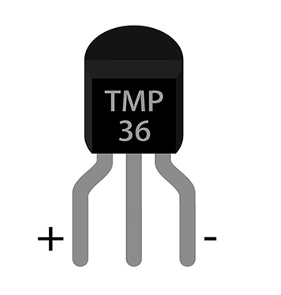
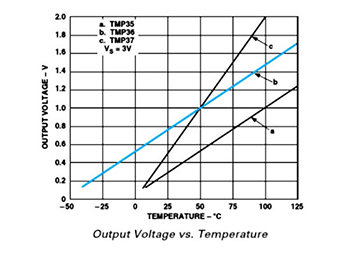
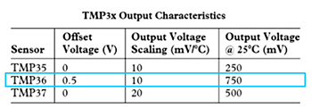
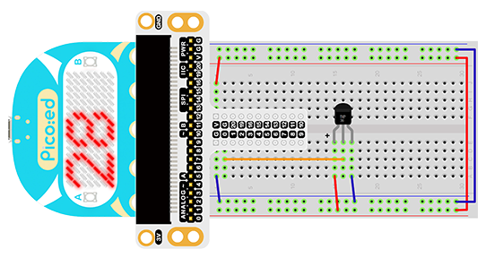

# Case 07:Temperature Sensor




## Introduction

The temperature sensor is a kind of sensor that can detect temperature and transfer it into output data. The temperature sensor is the core component of temperature gauges and instruments with multiple categories. In this experiment, we are going to learn the analog temperature sensor–TMP36, and display its data on [Pico:ed](https://www.elecfreaks.com/elecfreaks-pico-ed-v2.html).
## Components List

### Hardware：

1 × [Pico:ed](https://www.elecfreaks.com/elecfreaks-pico-ed-v2.html)
1 × USB Cable
1 × Breadboard Adapter
1 × Transparent Breadboard - 83 * 55 mm
1 × TMP36 Temperature Sensor
n x Breadborad Jumper Wire 65pcs Pack


## Major Components Introduction

### TMP36
TMP36 is a kind of analog temperature sensor. Its output voltage and temperature forms a linear relationship. That means higher temperature will have bigger output voltage.



**Note：**
When we look at the front side marked “TMP36”, the left side pin of the chip is VCC, middle is Vout, and the right side pin is GND. Do not connect it wrong or the components connected might be damaged.



Here’s the curve chart for output voltage of TMP36 changing with temperature:





We can know from the above chart that the temperature formula is:

Temperature（℃）=(Output Voltage（mV）-500)/10

## Experimental Procedure

### Hardware Connection

Connect your components according to the picture below:

1. Connect the sensor to P0 port of the breadboard adapter.



You would see as below after you finish the connection:


## Software Programming
For programming environment preparation, please refer to [Introduction to the programming environment](https://www.yuque.com/elecfreaks-learn/picoed/er7nuh)
### Program as the picture shows：
```python
# Import the modules that we need
import board
import digitalio
import analogio
import picoed

# Set the pins of the [Pico:ed](https://www.elecfreaks.com/elecfreaks-pico-ed-v2.html)'s temperature sensor
temperature = analogio.AnalogIn(board.P0_A0)

# Display the temperature value detected by the temperature sensor
while True:
   # Convert analog value (0-65535) to voltage (0-3.3v)
   voltage = temperature.value * (3.3 / 65535)
   temperature_value = (voltage - 500) / 10
   picoed.display.scroll(temperature_value)
```
### Details for the code:

1. Support modules are required by the importer. The `board` module is a generic container for pin names. could use the `board` module to specify the pin to use. The `digitalio` module contains classes that provide access to basic digital IO. The `time` module contains functions for time settings.
```python
import board
import digitalio
import analogio
import picoed
```

2. Set the pins of the [Pico:ed](https://www.elecfreaks.com/elecfreaks-pico-ed-v2.html) temperature sensor.
```python
temperature = analogio.AnalogIn(board.P0_A0)
```
If you are using pins other than P0_A0 and P1_A1, you can enter the following code in the shell window below the Thonny editor and press Enter to view the numbers of other pins.
```python
>>> import board
>>> help(board)
object <module 'board'> is of type module
  __name__ -- board
  board_id -- elecfreaks_picoed
  BUZZER_GP0 -- board.BUZZER_GP0
  I2C0_SDA -- board.BUZZER_GP0
  I2C0_SCL -- board.I2C0_SCL
  BUZZER -- board.BUZZER
  BUZZER_GP3 -- board.BUZZER
  P4 -- board.P4
  P5 -- board.P5
  ...
```

3. Use an infinite loop to display the value detected by the temperature sensor to the [Pico:ed](https://www.elecfreaks.com/elecfreaks-pico-ed-v2.html)'s LED screen.
```python
while True:
   voltage = temperature.value * (3300 / 65535)
   temperature_value = (voltage - 500) / 10
   picoed.display.scroll(temperature_value)
```
## Results
The current temperature value is displayed on the [Pico:ed](https://www.elecfreaks.com/elecfreaks-pico-ed-v2.html) screen.

<iframe width="560" height="315" src="https://www.youtube.com/embed/l1Bdj64QIU8" title="YouTube video player" frameborder="0" allow="accelerometer; autoplay; clipboard-write; encrypted-media; gyroscope; picture-in-picture" allowfullscreen></iframe>

## Exploration

If we wanted to display the temperature in Fahrenheit on the [Pico:ed](https://www.elecfreaks.com/elecfreaks-pico-ed-v2.html) screen, how would we program it?

## Common Question
## For more information, please visit：
[Elecfreaks official documentation](https://www.elecfreaks.com/learn-en/)
