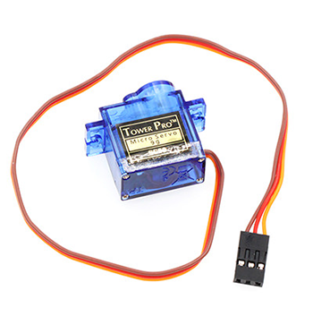
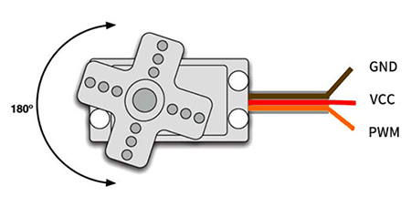
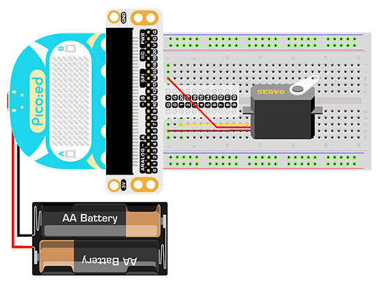

# Case 08:Servo


## Introduction

Servo is a position (angle) servo drive, suitable for those control systems that require a constant change of angle and can be maintained. In this lesson, we will use [Pico:ed](https://www.elecfreaks.com/elecfreaks-pico-ed-v2.html) to control the servos to cycle through the travel range.
## Components List:
### Hardware:
1 × [Pico:ed](https://www.elecfreaks.com/elecfreaks-pico-ed-v2.html)

1 × USB Cable

1 × Breadboard Adapter

1 × Transparent Breadboard - 83 * 55 mm

1 x TowerPro SG-90 Mini Servo

n x Breadboard Jumper Wire 65pcs Pack


## Major Component Introduction

### Servo

The steering gear is an automatic control system composed of a DC motor, a reduction gear set, a potentiometer, and a control circuit. Specify the output shaft rotation angle by sending a signal. Generally speaking, the steering gear has a maximum rotation angle (such as 180 degrees). The main difference from the ordinary DC motor is that the DC motor rotates in circles, and the steering gear can only rotate within a certain angle, not in a circle (the digital steering gear can be switched between the steering gear mode and the motor mode, without this question). Ordinary DC motors cannot feed back rotational angle information, but servos can. The uses are also different. Ordinary DC motors are generally used for full rotation for power, and steering gears are used to control an object to rotate at a certain angle, such as the joints of a robot. The servo system of the steering gear is controlled by pulses of variable width, and the control line is used to transmit the pulses. Pulse parameters are minimum, maximum, and frequency. Generally speaking, the reference signal of the servo is 20ms in period and 1.5ms in width. The position defined by this reference signal is the intermediate position. The steering gear has a maximum rotation angle, and the definition of the middle position is that the amount from this position to the maximum angle and the minimum angle is board import the same. The most important point is that the maximum rotation angle of different servos may be different, but the pulse width at the middle position is certain, that is, 1.5ms.



There are many specifications for servos, but all servos have three external wires, which are distinguished by three colors: brown, red, and orange (different brands may have slightly different colors), brown is the ground wire, and red is the positive pole of the power supply line, orange is the signal line.



## Experimental Procedure
### Hardware Connection
Connect your components according to the picture below:
1. Connect the servo to the P1 port of the expansion board



You would see as below after you finish the connection:

## Software Programming
For programming environment preparation, please refer to [Introduction to the programming environment](https://www.yuque.com/elecfreaks-learn/picoed/er7nuh)
### Program as the picture shows：
```python
# Import the modules that we need
import time
import board
import pwmio
from adafruit_motor import servo

# Set the pins of the servo and create the servo object
pwm = pwmio.PWMOut(board.P1_A1, duty_cycle=2 ** 15, frequency=50)
my_servo = servo.Servo(pwm)

# Cyclic rotation the servo
while True:
    for angle in range(0, 180, 5): 
        my_servo.angle = angle
        time.sleep(0.05)
    for angle in range(180, 0, -5):
        my_servo.angle = angle
        time.sleep(0.05)
```
### Details for the code:

1. Support modules are required by the importer. The `board` module is a generic container for pin names. could use the `board` module to specify the pin to use. The `digitalio` module contains classes that provide access to basic digital IO. The `time` module contains functions for time settings.
```python
import time
import board
import pwmio
from adafruit_motor import servo
```

2. Set the pins of the servo and create the servo object.
```python
pwm = pwmio.PWMOut(board.P1_A1, duty_cycle=2 ** 15, frequency=50)
my_servo = servo.Servo(pwm)
```
If you are using pins other than P0_A0 and P1_A1, you can enter the following code in the shell window below the Thonny editor and press Enter to view the numbers of other pins.
```python
>>> import board
>>> help(board)
object <module 'board'> is of type module
  __name__ -- board
  board_id -- elecfreaks_picoed
  BUZZER_GP0 -- board.BUZZER_GP0
  I2C0_SDA -- board.BUZZER_GP0
  I2C0_SCL -- board.I2C0_SCL
  BUZZER -- board.BUZZER
  BUZZER_GP3 -- board.BUZZER
  P4 -- board.P4
  P5 -- board.P5
  ...
```

3. Use infinite loop to set the servo to rotate back and forth between 0 and 180 degrees.
```python
while True:
    for angle in range(0, 180, 5): 
        my_servo.angle = angle
        time.sleep(0.05)
    for angle in range(180, 0, -5):
        my_servo.angle = angle
        time.sleep(0.05)
```
## Result

We can see the servo rotates with angle range from 0 degree to 180 degree.

<iframe width="560" height="315" src="https://www.youtube.com/embed/mCt3COUNXK8" title="YouTube video player" frameborder="0" allow="accelerometer; autoplay; clipboard-write; encrypted-media; gyroscope; picture-in-picture" allowfullscreen></iframe>

## Exploration

If we want to make a pointer thermometer with a temperature sensor and a servo, how should we design the circuit and program it?
## Common Question
## For more information, please visit：
[Elecfreaks official documentation](https://www.elecfreaks.com/learn-en/)
