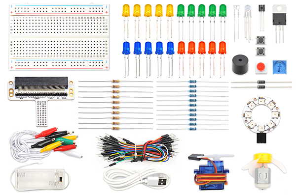
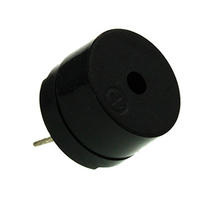
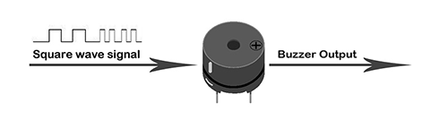
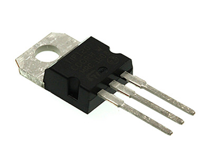
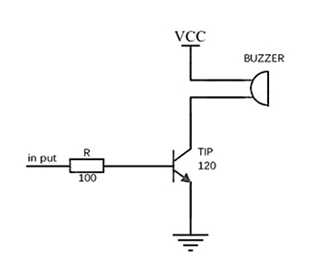
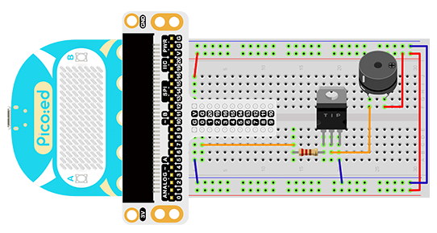

# Case 09:Buzzer


## Introduction

Buzzer is an integrated electronic sounder, widely used in computers, printers, copiers, alarms, electronic toys, automotive electronic equipment, telephones, timers and other electronic products as sounding devices. In this lesson, we use the [Pico:ed](https://www.elecfreaks.com/elecfreaks-pico-ed-v2.html) to drive the buzzer, making it sound different syllables, like a siren.

## Products Link

[ELECFREAKS Pico:ed Starter Kit](https://www.elecfreaks.com/elecfreaks-pico-ed-starter-kit.html) 

## Components List:
### Hardware:
1 × [Pico:ed](https://www.elecfreaks.com/elecfreaks-pico-ed-v2.html)

1 × USB Cable

1 × Breadboard Adapter

1 × Transparent Breadboard - 83 * 55 mm

1 × Mini Speaker (Buzzer)

1 × TIP 120 NPN Transistor

1 × 100 Ohm Resistors

n x Breadboard jumper wire 65pcs pack





## Major Components Introduction

### Buzzer

Buzzer is a kind of voice device. It is made of vibration and resonance device. According to the difference of control method, we can divide buzzer into active type and passive type.



Here’s the working principle of active buzzer: Because active buzzer has integrated amplify sampling circuit and resonance system, when DC power input passes through active buzzer, it will make resonance device generate sound signal. We can see the schematic diagram below for the working principle of active buzzer:


The working principle of passive buzzer is: When square wave signal passes through the buzzer, its resonance device will transform the square wave signal input into sound signal output. Below is the schematic diagram for the working principle of passive buzzer:



Note: In this experiment, we use passive buzzer only.

### Transistor

Transistor is a kind of semi-conductor component for current control. It is used to amplify the weak signal to signal with larger frequency.



If we input PWM signal produced by micro:bit into buzzer directly, the buzzer will send out feeble voice. This is because the drive current of I/O port is usually too weak to directly drive components like buzzer. At this time, we have to use transistor to amplify the current of PMW signal so that the buzzer can alarm properly. Here is the circuit diagram for a typical application of using transistor to drive buzzer:



## Experimental Procedure

### Hardware Connection

Connect your components according to the picture below:

1.Connect the buzzer, the 100Ω resistor and the transistor in series, then connect to P0 port.



You would see as below after you finish the connection:

## Software Programming
For programming environment preparation, please refer to [Introduction to the programming environment](https://www.elecfreaks.com/learn-en/pico-ed/index.html)
### Program as the picture shows：
```python
# Import the modules that we need
import board
import pwmio
import time

# Set the pins used by the buzzer and use the syllable play function
piezo = pwmio.PWMOut(board.P0_A0, duty_cycle=0,frequency=440, variable_frequency=True)
def play_note(note):
    piezo.frequency = note
    piezo.duty_cycle = 65535 // 2
    time.sleep(0.25)
    piezo.duty_cycle = 0
    time.sleep(0.05)
    
# Loop a specific syllable
while True:
    play_note(494)
    time.sleep(0.2)
    play_note(262)
    time.sleep(0.2)
    play_note(294)
    time.sleep(0.2)
```
### Details for the code:

1.Support modules are required by the importer. The `board` module is a generic container for pin names. could use the `board` module to specify the pin to use. The `pwmio `module contains classes that provide access to basic digital IO. The `time` module contains functions for time settings.
```python
import board
import pwmio
import time
```

2.Set the pins used by the buzzer and use the syllable play function.
```python
piezo = pwmio.PWMOut(board.P0_A0, duty_cycle=0,frequency=440, variable_frequency=True)
def play_note(note):
    piezo.frequency = note
    piezo.duty_cycle = 65535 // 2
    time.sleep(0.25)
    piezo.duty_cycle = 0
    time.sleep(0.05)
```
If you are using pins other than P0_A0 and P1_A1, you can enter the following code in the shell window below the Thonny editor and press Enter to view the numbers of other pins.
```python
>>> import board
>>> help(board)
object <module 'board'> is of type module
  __name__ -- board
  board_id -- elecfreaks_picoed
  BUZZER_GP0 -- board.BUZZER_GP0
  I2C0_SDA -- board.BUZZER_GP0
  I2C0_SCL -- board.I2C0_SCL
  BUZZER -- board.BUZZER
  BUZZER_GP3 -- board.BUZZER
  P4 -- board.P4
  P5 -- board.P5
  ...
```

3.Loop a specific syllable.
```python
while True:
    play_note(494)
    time.sleep(0.2)
    play_note(262)
    time.sleep(0.2)
    play_note(294)
    time.sleep(0.2)
```
## Results
The sound of the buzzer loops back and forth between specific syllables.

<iframe width="560" height="315" src="https://www.youtube.com/embed/Esf5J-gvmtQ" title="YouTube video player" frameborder="0" allow="accelerometer; autoplay; clipboard-write; encrypted-media; gyroscope; picture-in-picture" allowfullscreen></iframe>

## Exploration
If we want to make a high temperature alarming device with a temperature sensor and a buzzer, then how can we design circuit and program?
## Common Question
## For more information, please visit：
[Elecfreaks official documentation](https://www.elecfreaks.com/learn-en/)
