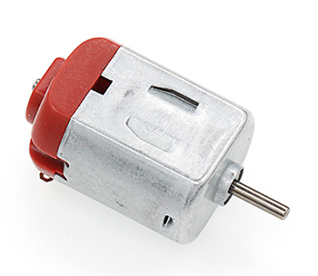
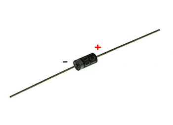
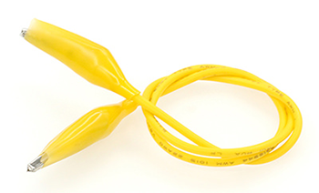
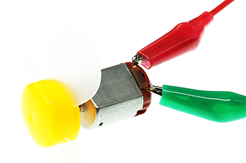
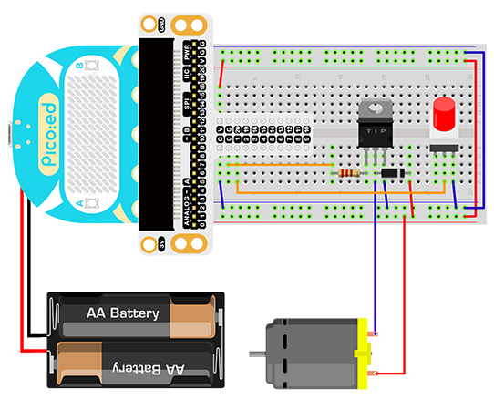
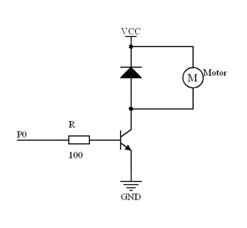

# Case 10:Motor


## Introduction

The motor is a kind of device which can transfer electric energy into kinetic energy according to the law of electromagnetic induction. In this lesson, we are going to use a switch to control the start and stop of a motor.

## Products Link

[ELECFREAKS Pico:ed Starter Kit](https://www.elecfreaks.com/elecfreaks-pico-ed-starter-kit.html) 


## Components List:
### Hardware:

1 × [Pico:ed](https://www.elecfreaks.com/elecfreaks-pico-ed-v2.html)

1 × USB Cable

1 × Breadboard Adapter

1 × Transparent Breadboard - 83 * 55 mm

1 × 5V Miniature Motors

1 × TIP 120 NPN Transistor

1 × 1N4007 Diodes

1 × 100 Ohm Resistors

2 × Alligator Clip Wires

1 × self-lock switch

n x Breadboard Jumper Wire 65pcs Pack


## Major Components Introduction

### Motor

The motor is a kind of device that can transfer electric energy into kinetic energy according to the law of electromagnetic induction. The motor has a lot of categories. In our experiment, the motor we use is a DC motor. When we supply DC voltage to the two terminals of the motor, it will rotate. The higher the voltage, the faster it rotates.



### Diodes

A diode is a kind of component with two polarities: one is positive and the other is negative. It allows the current move from the positive end to the negative end only. We can regard it as an electronic check valve. For a common diode, we can judge from the color of the tube for its polarity. The terminal with white color is negative polar.



### Alligator Clip Wires

Similar to the usage of the jumper cable, alligator clip wire is used when some components are not suitable to use jumper cable for connection.



In this experiment, we use an alligator clip wire to connect our motor.



## Experimental Procedure

### Hardware Connection

Connect your components according to the picture below:



The drive current of the IO port of the [Pico:ed](https://www.elecfreaks.com/elecfreaks-pico-ed-v2.html) is very weak, not enough to directly drive the motor. At this time, we need to use a triode to amplify the current of the IO signal. The circuit diagram of using a triode to amplify the signal current of the IO port is very similar to the circuit diagram of driving the buzzer in the previous lesson. The only difference is that one is added at both ends of the motor. diode. This diode is called a freewheeling diode in this circuit.

There is a coil in the motor, and when the coil passes current, an induced electromotive force is generated at both ends of the coil. When the current disappears, the induced electromotive force will generate a reverse voltage on the components in the circuit, which may damage the device. The freewheeling diode is connected in reverse parallel to both ends of the coil in the circuit. When the inductance coil is powered off, the electromotive force at both ends will not disappear immediately, and the residual electromotive force is released through the diode at this time. This is a classic protection design.
The schematic diagram is as follows:



You would see as below after you finish the connection:

## Software Programming

For programming environment preparation, please refer to [Introduction to the programming environment](https://www.elecfreaks.com/learn-en/pico-ed/index.html)
### Program as the picture shows：
```python
# Import the modules that we need
import board
import digitalio

# Set the pin and pin direction for motor and self-lock switch connections
motor = digitalio.DigitalInOut(board.P0_A0)
locking = digitalio.DigitalInOut(board.P1_A1)
motor.direction = digitalio.Direction.OUTPUT
locking.direction = digitalio.Direction.INPUT

# Set the self-locking switch to pull up
locking.pull = digitalio.Pull.UP

# Cycle to judge the state of the self-locking switch to change the state of the motor
while True:
    if locking.value == False:
        motor.value = True
    else:
        motor.value = False
```
### Details for the code:

1.Support modules are required by the importer. The `board` module is a generic container for pin names. could use the `board` module to specify the pin to use. The `digitalio` module contains classes that provide access to basic digital IO. The `time` module contains functions for time settings.
```python
import board
import digitalio
```

2.Set the pin and pin direction connection between the motor and the self-locking switch, set the initial value of the motor to True, and pull up the self-locking switch.
```python
motor = digitalio.DigitalInOut(board.P0_A0)
locking = digitalio.DigitalInOut(board.P1_A1)
motor.direction = digitalio.Direction.OUTPUT
locking.direction = digitalio.Direction.INPUT
```
If you are using pins other than P0_A0 and P1_A1, you can enter the following code in the shell window below the Thonny editor and press Enter to view the numbers of other pins.
```python
>>> import board
>>> help(board)
object <module 'board'> is of type module
  __name__ -- board
  board_id -- elecfreaks_picoed
  BUZZER_GP0 -- board.BUZZER_GP0
  I2C0_SDA -- board.BUZZER_GP0
  I2C0_SCL -- board.I2C0_SCL
  BUZZER -- board.BUZZER
  BUZZER_GP3 -- board.BUZZER
  P4 -- board.P4
  P5 -- board.P5
  ...
```

3.Set the self-locking switch to pull up.
```python
locking.pull = digitalio.Pull.UP
```

4.The state of the self-locking switch is judged cyclically to change the state of the motor.
```python
while True:
    if locking.value == False:
        motor.value = True
    else:
        motor.value = False
```
## Results
When the button is pressed, the motor starts to spin, and when the button is pressed again, the motor stops spinning.

**Note**： The power supply voltage of the [Pico:ed](https://www.elecfreaks.com/elecfreaks-pico-ed-v2.html) is relatively low, only 3V. When the button is pressed, the motor may not start. In this case, please turn the fan blade of the motor by hand, and the motor can rotate normally.

<iframe width="560" height="315" src="https://www.youtube.com/embed/X6HIyg2OUZg" title="YouTube video player" frameborder="0" allow="accelerometer; autoplay; clipboard-write; encrypted-media; gyroscope; picture-in-picture" allowfullscreen></iframe>

## Exploration
If a potentiometer is to be used for speed control of the motor, how should the circuit be designed and programmed?
## Common Question
## For more information, please visit：
[Elecfreaks official documentation](https://www.elecfreaks.com/learn-en/)
