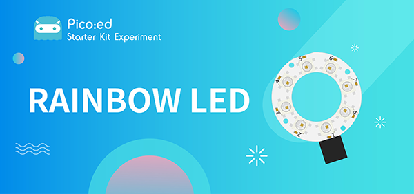
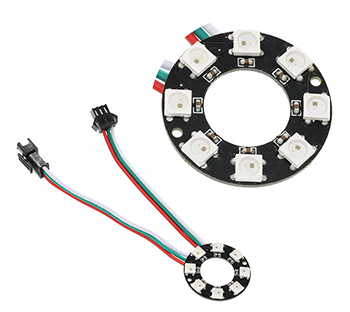
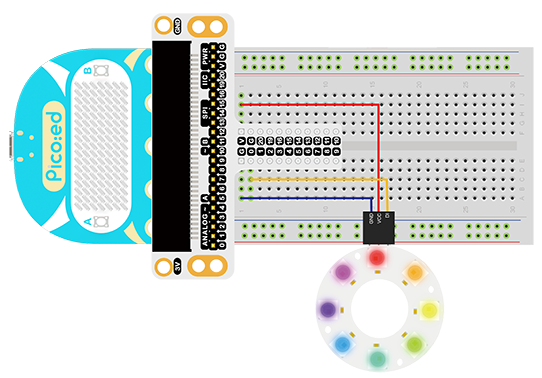

# Case 11:Rainbow LED



## Introduction

The 8 RGB Rainbow LED Ring is based on ws2812b lamp beads. Its biggest feature is single IO control and infinite cascade. In this lesson, we will use [Pico:ed](https://www.elecfreaks.com/elecfreaks-pico-ed-v2.html) to drive an LED colorful light ring to achieve colorful effects.

## Products Link

[ELECFREAKS Pico:ed Starter Kit](https://www.elecfreaks.com/elecfreaks-pico-ed-starter-kit.html) 


## Component List

### Hardware:

1 × [Pico:ed](https://www.elecfreaks.com/elecfreaks-pico-ed-v2.html)

1 × USB Cable

1 × Breadboard Adapter

1 × Transparent Breadboard - 83 * 55 mm

1 x 8 RGB Rainbow LED Ring

n x Breadborad Jumper Wire 65pcs Pack


## Major Component Introduction

### **8 RGB Rainbow LED Ring**



8 RGB Rainbow LED Ring is an LED ring made of 8 ws2812b beads in cascade connection. Ws2812b is an intelligent outer control LED source, which has integrated control circuit and light emitting circuit. It has same appearance with 5050LED bead.

The digital protocol adopts communication method of single line goes to zero. After pixel point restoration, DIN will receive the data sent from the controller. Once the first 24-bit data received was extracted by the first pixel point, it will be sent to the internal digital lock storage device of pixel point and the rest data amplified through the inner transformation processing circuit will be sent to the next pixel point from DO port. Every time it passes through a pixel point transmission, the signal will decrease 24bit. The pixel point uses automatic transformation forwarding technique, thus the pixel cascade connection quantity do not limited by signal transmission but the speed of transmission only.

LED has advantages of low voltage drive, energy-saving and environment protect, wide scattering angle, good consistency, ultra-long life, etc.. To integrate control circuit onto LED, the circuit will become more simple, easier to install and have smaller volume.

## Experimental Procedure

### Hardware Connection

Connect your components according to the picture below:

1.Connect the signal wire of the LED ring to the P0 port of the breadboard adapter.



***Note:*** There are two cables led out by the ring. One is DI and the other is DO. We should connect DI. After connection, we can see:

### Software Programming

For programming environment preparation, please refer to [Introduction to the programming environment](https://www.elecfreaks.com/learn-en/pico-ed/index.html)
### Program as the picture shows：
```python
# Import the modules that we need
import board
import random
import neopixel_write
import digitalio
import time

# Set the pins and pin direction of the 8 RGB Rainbow LED Ring
pin = digitalio.DigitalInOut(board.P0_A0)
pin.direction = digitalio.Direction.OUTPUT

# Initialization list for storing the RGB values of the light ring
rings = [0, 0, 0, 0, 0, 0, 0, 0, 0, 0, 0, 0, 0, 0, 0, 0, 0, 0, 0, 0, 0, 0, 0, 0]

# Cyclically change the RGB value of each light in the colorful light ring
while True:
    for i in range(len(rings)):
        rings[i] = random.randint(0,255)
    pixel_off = bytearray(rings)
    neopixel_write.neopixel_write(pin, pixel_off)
    time.sleep(0.1)
```
### Details for the code:

1.Support modules are required by the importer. The `board` module is a generic container for pin names. could use the `board` module to specify the pin to use. The `digitalio` module contains classes that provide access to basic digital IO. The `time` module contains functions for time settings. The `random` module contains functions that provide to create random numbers。 The `neopixel_write`  module contains a helper method to write out the bytes in the 800khz neopixel protocol.
```python
import board
import random
import neopixel_write
import digitalio
import time
```

2.Set the pins and pin direction of the 8 RGB Rainbow LED Ring
```python
pin = digitalio.DigitalInOut(board.P0_A0)
pin.direction = digitalio.Direction.OUTPUT
```
If you are using pins other than P0_A0 and P1_A1, you can enter the following code in the shell window below the Thonny editor and press Enter to view the numbers of other pins.
```python
>>> import board
>>> help(board)
object <module 'board'> is of type module
  __name__ -- board
  board_id -- elecfreaks_picoed
  BUZZER_GP0 -- board.BUZZER_GP0
  I2C0_SDA -- board.BUZZER_GP0
  I2C0_SCL -- board.I2C0_SCL
  BUZZER -- board.BUZZER
  BUZZER_GP3 -- board.BUZZER
  P4 -- board.P4
  P5 -- board.P5
  ...
```

3.Initialization list for storing the RGB values of the light ring
```python
rings = [0, 0, 0, 0, 0, 0, 0, 0, 0, 0, 0, 0, 0, 0, 0, 0, 0, 0, 0, 0, 0, 0, 0, 0]
```

4.Cyclically change the RGB value of each light in the colorful light ring
```python
while True:
    for i in range(len(rings)):
        rings[i] = random.randint(0,255)
    pixel_off = bytearray(rings)
    neopixel_write.neopixel_write(pin, pixel_off)
    time.sleep(0.1)
```
## Results
We can see the light of 8 RGB Rainbow LED Ring is rotating with rainbow color.

<iframe width="560" height="315" src="https://www.youtube.com/embed/4T4sBpUYp-k" title="YouTube video player" frameborder="0" allow="accelerometer; autoplay; clipboard-write; encrypted-media; gyroscope; picture-in-picture" allowfullscreen></iframe>

## Exploration

Imagine the ring is a big eye, in order to make it twinkle, then how to design circuit and program?
## Common Question
## For more information, please visit：
[Elecfreaks official documentation](https://www.elecfreaks.com/learn-en/)
