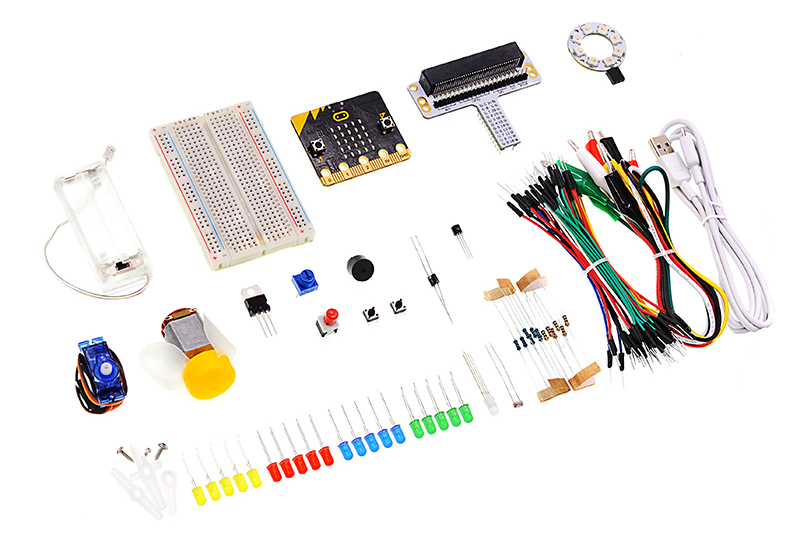
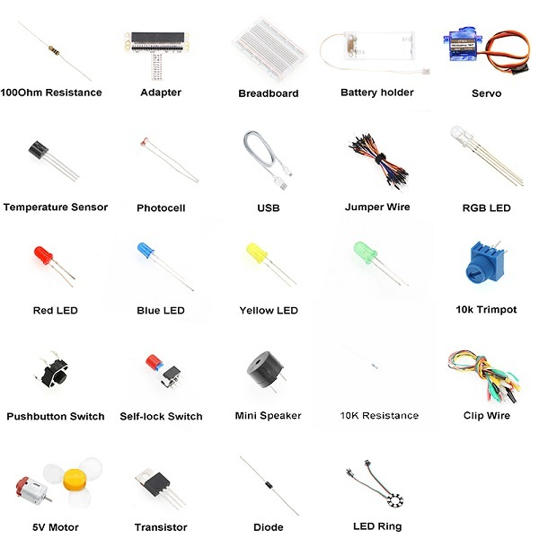

# Information about the Kit

## Introduction
The Pico:ed Starter kit developed by ELECFREAKS is for teenagers to learn circuits and programming.

The kit provides some basic electronic components such as LEDS, buttons, buzzers, temperature sensors, servos, motors, rainbow LED and others. We've also provided many wiki references to help you get started, the kit helps you enter a wonderful electronic world. 

## The Kits Include

## FAQ
