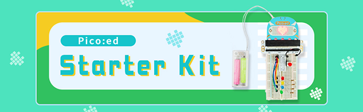

# Introduction

The Pico:ed Little Scientist Kit is a Pico:ed starter kit developed by the ELECFREAKS team for teens to learn circuits and programming.
The kit provides numerous electronic components such as LEDs, buttons, buzzers, temperature sensors, servos, motors and colorful light rings. It also comes with numerous reference cases and detailed documentation to help you get started quickly. The Pico:ed Little Scientist Kit accompanies you into the wonderful world of electronics.

## Kit contains

## Common problem
