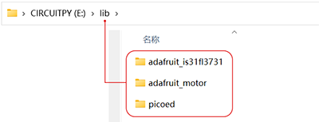
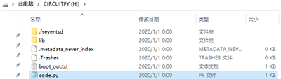
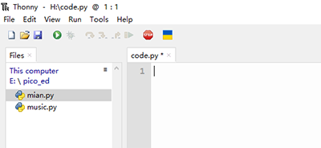

# Prepare the Programming

1. We need to code in programming software, download and install the programming software that we recommend: [Thonny](https://thonny.org/). If you have already installed Thonny and selected the correct interpreter, please ignore this step, if not, you can refer to the specific installation steps: [Download and install the programming software](https://www.yuque.com/elecfreaks-learn/picoed/ggnxx2).

2. Then we need to prepare the firmware for picoed and burn the firmware into Pico:ed. Firmware is the device "driver" that is stored inside the device and through which we write the code to implement the actions of a particular machine according to the standard device drivers. Firmware is the software that does the most basic and lowest-level work of a system. In a hardware device, the firmware is the soul of the hardware device. If you are not familiar with how to burn picoed firmware into Pico:ed, you can refer to this article: [Firmware Installation Steps](https://www.yuque.com/elecfreaks-learn/picoed/pw6wvm)

3. For the functions we want to use with Pico:ed, such as the A/B button, we need to add the picoed library file, if you are not sure about the way to add them, you can refer to this article: [Add the picoed library](https://www.yuque.com/elecfreaks-learn)

## Prepare the Libraries for Projects
---
We will need to other libraries for the following projects. 

1. [CircuitPython_IS31FL3731](https://github.com/adafruit/Adafruit_CircuitPython_IS31FL3731/archive/refs/heads/main.zip). `CircuitPython_IS31FL3731` includes the way to control the LED screen of Pico:ed. 
1. [CircuitPython_Motor](https://github.com/adafruit/Adafruit_CircuitPython_Motor/archive/refs/heads/main.zip). `CircuitPython_Motor` contains the way to control the motors and servos. 
1. Next, please follow the steps to add the picoed library files by placing `adafruit_motor`, `adafruit_is31fl3731` in the lib folder of the CIRCUITPY disk. 

The code for the following cases is written in the code.py file on the CIRCUITPY disk, which can be opened with the installed Thonny to write the code.

