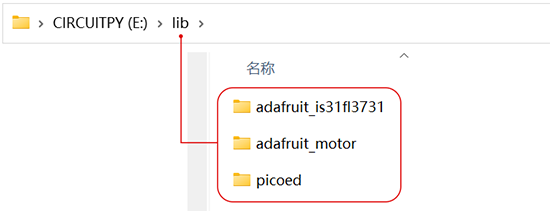
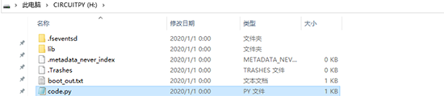
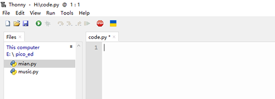

# Setting up the programming environment

1. We need to write programs in programming software, so we should first download and install programming software, we recommend programming software is: [Thonny](https://thonny.org/) . If you have already installed Thonny and selected the correct interpreter, please ignore this step, if not, you can refer to the specific installation steps：[ Download and install the programming software](https://www.yuque.com/elecfreaks-learn/picoed/ggnxx2).
1. Next, we need to prepare the firmware for pico:ed and burn the firmware into Pico: ed. Firmware refers to the device "driver" stored inside the device. Through the firmware, the code we write can realize the operation of a specific machine according to the standard device driver. Firmware is the software that performs the most basic and bottom-level work of a system. In hardware devices, firmware is the soul of hardware devices. If you are not familiar with how to burn pico:ed firmware into Pico:ed, you can refer to this article:[Firmware Installation Steps](https://www.yuque.com/elecfreaks-learn/picoed/pw6wvm)
1. For the functions we want to use Pico:ed, such as the A/B button, we need to add the pico: ed library file. Similarly, if you are not clear about how to add the pico:ed library file, you can refer to this article .[Add pico:ed library](https://www.yuque.com/elecfreaks-learn/picoed/wkzbth)

## Preparation of library files required for the case
In the following cases, other related libraries are also required to ensure that you can complete all the case effects:

1. [CircuitPython_IS31FL3731](https://github.com/adafruit/Adafruit_CircuitPython_IS31FL3731/archive/refs/heads/main.zip).`CircuitPython_IS31FL3731`library‘s files contains methods for controlling the Pico:ed's LED display.
1. [CircuitPython_Motor](https://github.com/adafruit/Adafruit_CircuitPython_Motor/archive/refs/heads/main.zip).`CircuitPython_Motor`library's files Contains the control methods for motors and servos.
1. Next, follow the steps to add the picoed library file put `adafruit_motor`、`adafruit_is31fl3731`Put it in the lib folder of the CIRCUITPY disk, as shown below.

The code for the next case is written in the code.py file on the CIRCUITPY disk. Use the installed Thonny to open code.py to write the code.

