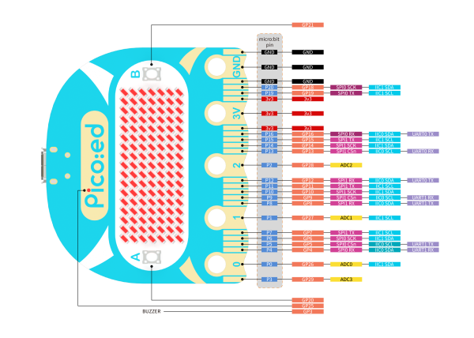
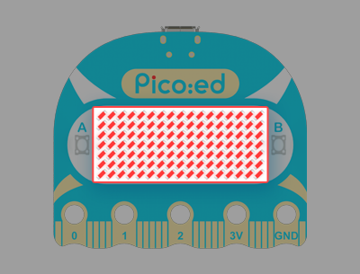
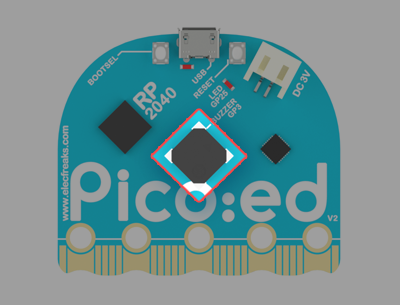

# Pico:ed V2

## Introduction
[Pico:ed V2](https://www.elecfreaks.com/elecfreaks-pico-ed-v2.html) is an educational development board developed by ELECFREAKS based on Raspberry Pi Pico. [Pico:ed V2](https://www.elecfreaks.com/elecfreaks-pico-ed-v2.html)  is based on the acclaimed RP2040 microcontroller which is the most popular microcontroller in the world, and we have added the resets button to make it easier for users to operate. [Pico:ed V2](https://www.elecfreaks.com/elecfreaks-pico-ed-v2.html)  adopts a more rounded shape design: the head is changed to an arc, and the pin edge adopts a wavy beautiful design so that users are less likely to hurt their hands when using it. It is also good to see that there are more choices to the colors of the LED screen which are able to meet the demands for personalization on [Pico:ed V2](https://www.elecfreaks.com/elecfreaks-pico-ed-v2.html) .
[Pico:ed V2 ](https://www.elecfreaks.com/elecfreaks-pico-ed-v2.html) retains two programmable buttons and a firmware burn-in button, a separate power supply, USB connection ports, and an onboard 7 x 17 LED dot matrix screen for additional graphics and text display. [Pico:ed V2](https://www.elecfreaks.com/elecfreaks-pico-ed-v2.html) uses CircuitPython or C++ programming method, you can learn to program it alone or you can play it with other educational products from our company, such as Ring:bit Car V2, Cutebot Car V3, Starter Kit, and so on! Start your inventive and creative thinking while playing it! 

## Related Links

Purchase: [ELECFREAKS Pico:ed V2](https://www.elecfreaks.com/elecfreaks-pico-ed-v2.html)

## Specifications

| Item                   | ELECFREAKS Pico:ed V2             |
| ---------------------- | --------------------------------- |
| Microcontroller        | RP2040                            |
| Random Access Memory   | 264KB of SRAM                     |
| Flash  Memory          | 2MB Flash storage                 |
| Universal Input/Output | 19-pin Universal edge connector   |
|                        | 4 × Analog inputs                 |
|                        | 3 × GPIO alligator clip connector |
|                        | 2 × IIC interfaces                |
|                        | 2 × SPI interfaces                |
|                        | 2 × UART interfaces               |
| Programmable Buttons   | 2 Units                           |
| LED Matrix             | 7 × 17 LED matrix screen          |
| Buzzer                 | 1 X Passive buzzer                |
| Size                   | 52 × 42mm                         |
| Power Supply           | USB or 2* AAA batteries           |
| Maximum input voltage at USB | 6.5V                |
| Goldfinger maximum input voltage | 3.3V                |
| Programming Methods    | CircuitPython/C++                 |

## Function Introduction

### Pins

Pins are used as a way to physically connect to externally connected components and can be combined with the corresponding expansion boards or crocodile clip cables introduced by ELECFREAKS to extend the usability of the Pico:ed V2 even more.
For detailed tutorials, please see: [Digitalio Module - Basic Digital Pin Support](http://www.elecfreaks.com/learn-en/pico-ed/digitalio-module-basic-digital-pin-support.html)

**Pin Diagram**

HD version download link：[Pico-ed-V2-Pin-Diagram.pdf](https://github.com/elecfreaks/learn-en/raw/master/pico-ed/file/Pico-ed-V2-Pin-Diagram.pdf)

### A/B Button

Pico:ed V2 has two programmable input buttons on the front. Each button can be programmed individually or used together. Generally used to trigger events.
For detailed tutorials, please see: [Buttons](http://www.elecfreaks.com/learn-en/pico-ed/buttons.html)

### Sign Indicator

Programmable LED indicators.
For detailed tutorials, please see: [Onboard LED](http://www.elecfreaks.com/learn-en/pico-ed/onboard-led.html)

### 7×17 LED light matrix screen

Consisting of 7 x 17 LEDs, it can display rich patterns.
For detailed tutorials, please see: [LED dot-matrix screen](http://www.elecfreaks.com/learn-en/pico-ed/led-dot-matrix-screen.html)

### Buzzer

The buzzer is used in many devices as a common output device and can be programmed to control it to play different kinds of music.
For detailed tutorials, please see: [Music](http://www.elecfreaks.com/learn-en/pico-ed/music.html)

