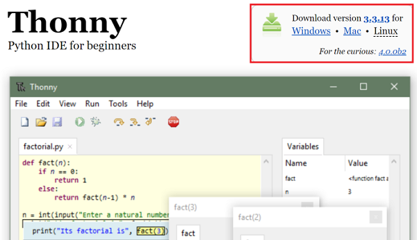
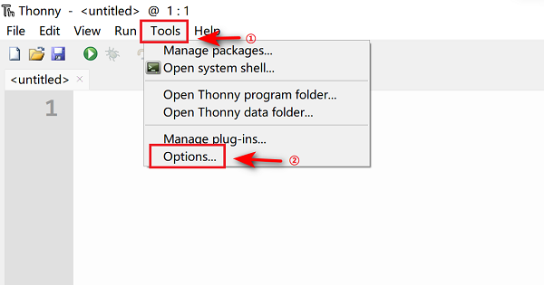
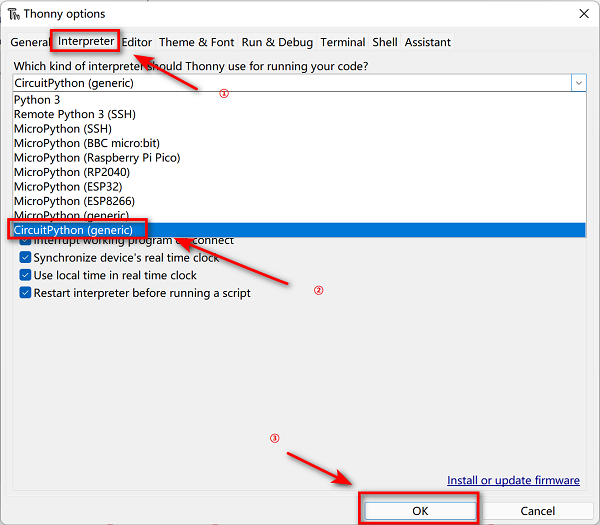
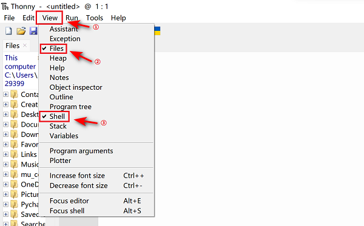
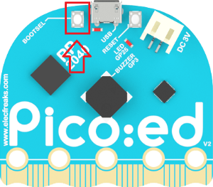
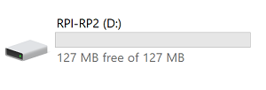
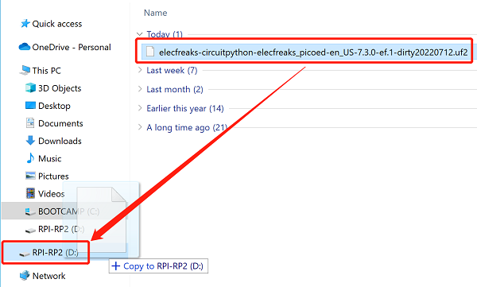
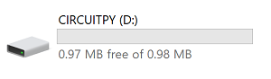
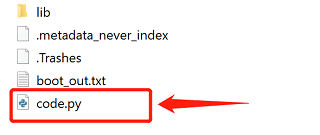

# Programming Environment Preparation for Pico:ed

## Download and Install the Software
---
When you start coding on Pico:ed, we recommend using the integrated development environment Thonny, which you can install by choosing the appropriate version for your computer system.

Download link:[https://thonny.org](https://thonny.org)

After the installment, click the “Options” from the drawer of the “Tools”. 

Choose “Interpreter”and click “CircuitPython(generic)”, then confirm it with the "OK".

Once added successfully you can start programming, it is recommended to click on View and check the box to open the shell and Files view.

## Installation Steps of the Firmware
---

Download the firmware of Pico:ed: [elecfreaks-circuitpython-elecfreaks_picoed-en_US-7.3.0-ef.1-dirty20220712.uf2](https://github.com/elecfreaks/circuitpython_picoed/releases/download/v1.1.0/elecfreaks-circuitpython-elecfreaks_picoed-en_US-7.3.0-ef.1-dirty20220712.uf2)

After downloading, press the BOOTSEL button to download. 

Long pressing the download button and connet with the USB cable, release the button until you see a disk named RPI-RP2 on the computer. 

Send the downloaded firmware to that disk. 

Pico:ed will reconnet automatically after getting the firmware downloaded, then you will see a CIRCUITPY disk. 

Now, you can start programming in code.py in CIRCUITPY. 

