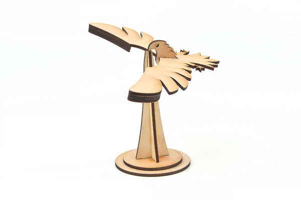

# Case 04: Balancing Birds

## Introduction

A toy that uses the beak of the bird to stop on your finger. No matter where you put the bird (where you can place it or on your finger), it can balance and stabilize without falling. Like a real bird to fly.
The reason why the bird canl balance is that the actual center of gravity of the whole bird is on the beak tip point. Although it looks like the bird's whole body is in the air and the bird's point of force is on its fingers, the actual weight of the bird's wings is heavier and the whole bird's center of gravity is directly below the tip of its beak.

## Materials used

[TOOCA laser 1](https://www.elecfreaks.com/elecfreaks-tooca-laser-1.html)

3mm Plywood

## Relevant parameters

|Model|TOOCA Laser 1|
|:-------:|:-------:|
|Material of consumables|Basswood board|
|Thickness|2.8mm|
|Power|100%|
|Speed|240mm/min|
|Times required to be engraved/cut|3|

Note: This case takes a 2.8mm basswood board as an example. If you need to use different thicknesses or use different materials, please modify the drawing by yourself and refer to the `Recommended parameter` modify the parameters of the software.

## Drawings download link

[Balancing birds.dxf](https://github.com/elecfreaks/learn-en/raw/master/tooca-laser-1/file/balance-bird.dxf.zip)

## Effect show

