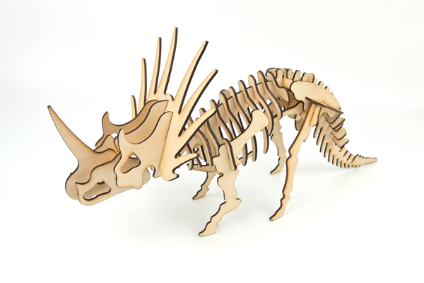
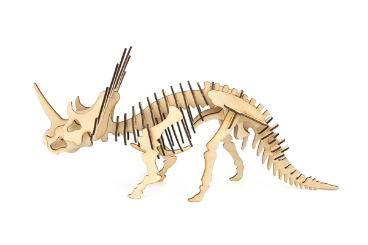
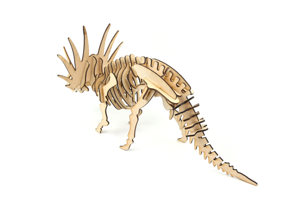
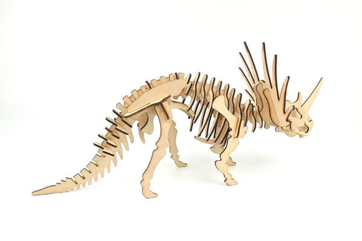

# Case 06: Halberd Dragon
## Introduction

The halberd dragon, also called spiny shield horned dinosaur, lived in the late Cretaceous period, is a kind of phytophagous horned dinosaur, the neck shield Halberd dragon's head is large, and the neck has a beautiful shield-shaped ring-shaped ornament. The shield ornaments around the long horn of six different sizes, constitute the Halberd dragon that big scary neck shield, this neck shield can not only scare the enemy. This neck shield generally grows spectacularly beautiful in strong and powerful males but is not developed in females, so experts speculate that its role is mainly for a display to attract the attention of the opposite sex. Because this neck shield looks very much like the ancient Chinese weapon in the halberd, it was figuratively named the halberd dragon. The strong limbs of the halberd dragon support the huge body. The horns of the halberd dragon and the bone spikes of the neck shield are like a sharp sword, which is a terrible weapon to turn defense into attack. The beak like a parrot's curved beak can cut to feed on the leaves of low plants. The halberd dragon's snout horn, about 60 cm long, is the main weapon when attacking.

## Materials Requested

[TOOCA laser 1](https://www.elecfreaks.com/elecfreaks-tooca-laser-1.html)

3mm Plywood

## Relevant Parameters

|Model|TOOCA Laser 1|
|:-------:|:-------:|
|Material of consumables|Basswood board|
|Thickness|2.8mm|
|Power|100%|
|Speed|240mm/min|
|Times required to be engraved/cut|3|

Note: This case takes a 2.8mm basswood board as an example. If you need to use different thicknesses or use different materials, please modify the drawing by yourself and refer to the `Recommended parameter` modify the parameters of the software.

## Drawings download link

[Halberd dragon.dxf](https://github.com/elecfreaks/learn-en/raw/master/tooca-laser-1/file/Halberd-20Dragon.dxf.zip)

## Effect Show

