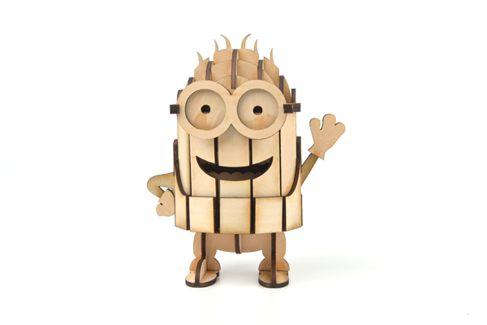
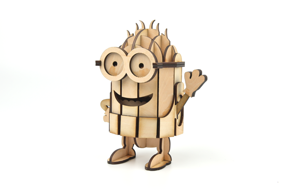
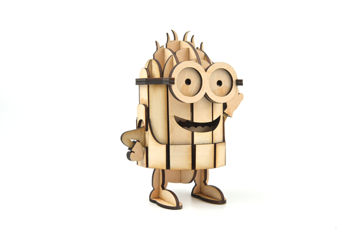

# Case 08: The Pencil Holder of the Minions

## Introduction

A pen holder is a columnar container for holding pens or other long stationery, and comes in a variety of shapes and materials. Traditional penholders are made of wood, stone, pottery, bamboo, and other materials.

## Materials used

[TOOCA laser 1](https://www.elecfreaks.com/elecfreaks-tooca-laser-1.html)

3mm Plywood

## Relevant parameters

|Model|TOOCA Laser 1|
|:-------:|:-------:|
|Material of consumables|Basswood board|
|Thickness|2.8mm|
|Power|100%|
|Speed|240mm/min|
|Times required to be engraved/cut|3|

Note: This case takes a 2.8mm basswood board as an example. If you need to use different thicknesses or use different materials, please modify the drawing by yourself and refer to the `Recommended parameter` modify the parameters of the software.

## Drawings Download Link

[Little yellow man pencil holder.dxf](https://github.com/elecfreaks/learn-en/raw/master/tooca-laser-1/file/Pen-holder.dxf.zip)

## Effect Show

## material data

More detail about the material：[laser cutting material](https://elecfreaks.com/download/tooca-laser/Cutting.zip)，[Laser engraving material](https://elecfreaks.com/download/tooca-laser/engraving.zip)
