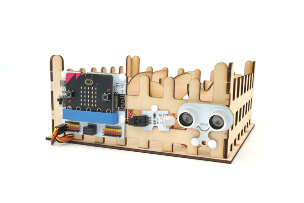
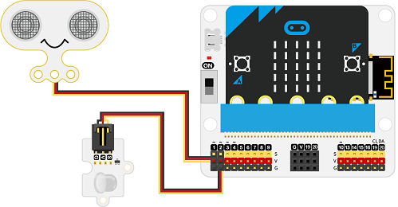
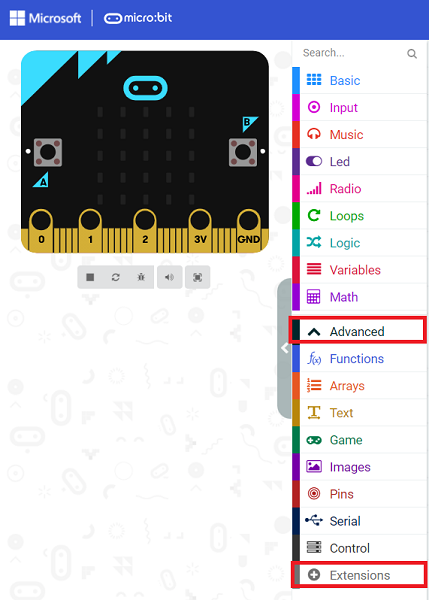
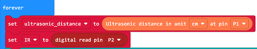
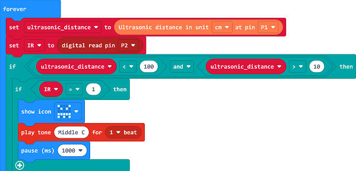
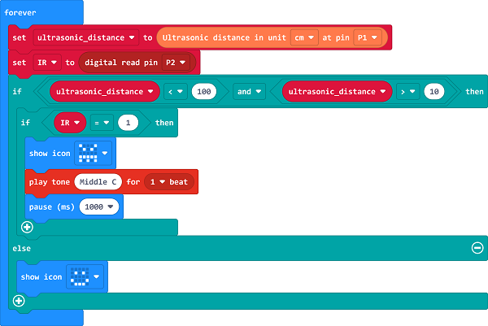
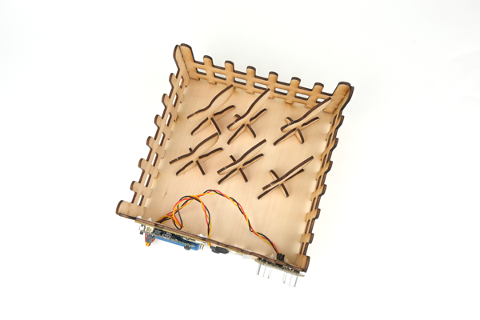

# Case 10: The Farm Protection Devices

## Introduction

In order to protect the farmlands from people to get in, we can set a farmland protection device.

## Materials Requested

[TOOCA laser 1](https://www.elecfreaks.com/elecfreaks-tooca-laser-1.html)

[Smart Agriculture Kit](https://www.elecfreaks.com/micro-bit-smart-agriculture-kit-without-micro-bit-board.html)

3mm Plywood

## Relevant Parameters

|Model|TOOCA Laser 1|
|:-------:|:-------:|
|Material of consumables|Basswood board|
|Thickness|2.8mm|
|Power|100%|
|Speed|240mm/min|
|Times required to be engraved/cut|3|

Note: This case takes a 2.8mm basswood board as an example. If you need to use different thicknesses or use different materials, please modify the drawing by yourself and refer to the `Recommended parameter` modify the parameters of the software.

## Drawings Download Link

[Farm protection devices.dxf](https://github.com/elecfreaks/learn-en/raw/master/tooca-laser-1/file/Cutting/farmland-protection-device/farmland-protection-device.dxf)

## Hardware Connection

Connect the Sonar:bit to P1, the PIR sensor to P2 on IoT:bit. 

## Software Programming 

Click "Advanced" in the MakeCode to see more choices.

For programming, we need to add a package: click "Extensions" at the bottom of the MakeCode drawer and search with "iot-environment-kit" in the dialogue box to download it. 

***Notice:*** If you met a tip indicating that some codebases would be deleted due to incompatibility, you may continue as the tips say or create a new project in the menu. 

## Program

Set the ultrasonic sensor to connect to P1, measure the distance in cm, and save the return value to the variable "ultrasonic_distance", set the PIR sensor to connect to P2, and save the return value to the variable "IR".

Judge whether the value of variable "ultrasonic_distance" is within the threshold, if so, judge whether the return value of variable "IR" is 1, if the return value of variable "IR" is 1, then set the LED matrix to display the icon and the buzzer to sound the alarm otherwise turn off the light.

If the value of the variable "ultrasonic_distance" is not within the threshold, set to display the icon as we progrommed.

Link: [https://makecode.microbit.org/_5PbACb8kLcqr](https://makecode.microbit.org/_5PbACb8kLcqr)

<iframe style="position:absolute;top:0;left:0;width:100%;height:100%;" src="https://makecode.microbit.org/#pub:https://makecode.microbit.org/_5PbACb8kLcqr" frameborder="0" sandbox="allow-popups allow-forms allow-scripts allow-same-origin">
</iframe>

  

## Results
When someone approaches the farmland, the farmland protection device will display the icon and sound an alarm to warn others to stay away.

## Effect Show

