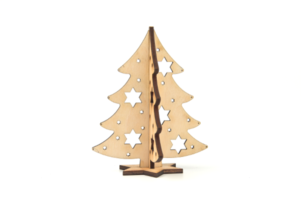

# Case 01: The Christmas Tree

## Introduction

A Christmas tree is an evergreen tree decorated with lighted candles and decorations of firs or cedars. As one of the important components of Christmas, the modern Christmas tree originated in Germany and gradually became popular worldwide, becoming one of the most famous traditions in Christmas celebrations.
It is said that the Christmas tree first appeared in ancient Rome in mid-December during the so-called Festival of the Gods of Agriculture. Nowadays it is common to get an evergreen plant such as a pine tree inside or outdoors around Christmas time and decorate it with Christmas lights and colorful decorations. An angel or star is placed at the top of the tree.

## Materials Required

[TOOCA laser 1](https://shop.elecfreaks.com/products/elecfreaks-tooca-laser-1?_pos=1&_sid=d04f6dda2&_ss=r)

3mm Plywood

## Relevant parameters

|Model|TOOCA Laser 1|
|:-------:|:-------:|
|Material of consumables|Basswood board|
|Thickness|2.8mm|
|Power|100%|
|Speed|240mm/min|
|Times required to be engraved/cut|3|

Note: This case takes a 2.8mm basswood board as an example. If you need to use different thicknesses or use different materials, please modify the drawing by yourself and refer to the `recommended parameter` modify the parameters of the software.

## Drawings download link

[ Christmas tree.dxf](https://github.com/elecfreaks/learn-en/raw/master/tooca-laser-1/file/christmas-tree-2.dxf.zip)

## Effect Show

## material data

More detail about the material：[laser cutting material](https://elecfreaks.com/download/tooca-laser/Cutting.zip)，[Laser engraving material](https://elecfreaks.com/download/tooca-laser/engraving.zip)

Welcome to join the [Laser Engraving Cutter Creative Sharing Community](https://www.facebook.com/groups/1152321032019436/) to share your creativity.
