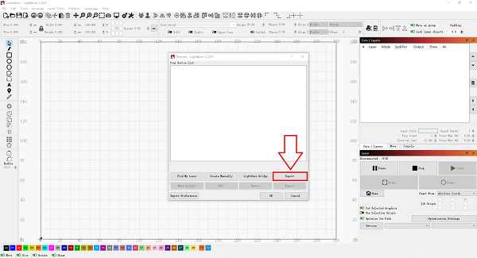
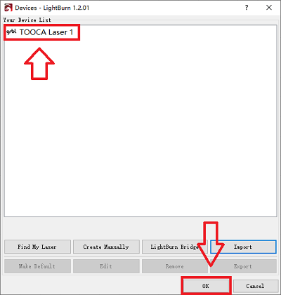
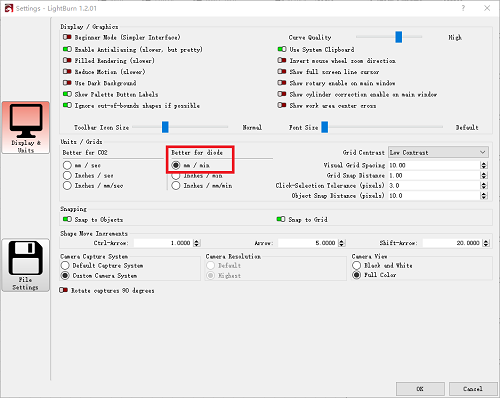
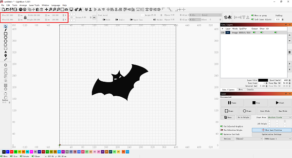
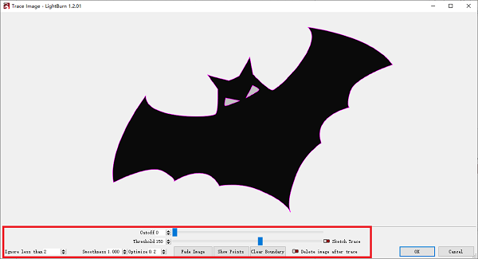
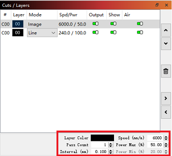
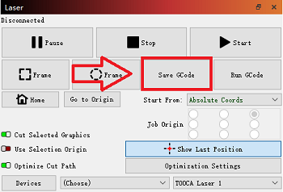

# LightBurn-Trace Image

Double-click the .exe file to install the LightBurn software (the installer inside the TF card is only compatible with Windows 64-bit systems, other versions)
Please visit the official website at https://lightburnsoftware.com/ to download.

Note: The free trial period for this software is 1 month, for details on purchasing the serial number, please visit https://lightburnsoft-
ware.com/collections/frontpage/products/lightburn-gcode

After successful installation, double click to open the LightBurn software and click "Import" to import the .lbdev configuration file from the TF card.

After importing, there is a corresponding machine in the device list, select the machine and click OK to configure successfully.

Click "Edit-Setting", select "mm/min", and click OK.

Click "File-Import" to import the image, and then set the position, size and rotation angle of the image.

Right-click the image, select Trace Image to set the image effect, and then click OK.

Set the appropriate power%, speed and number of times.
Note: The larger the power% is, or the slower the speed is, the deeper the engraving effect will be; the smaller the power% is, or the faster the speed is, the shallower the engraving effect will be. Power% is generally adjusted to Power 
Max can be adjusted. Recommended parameters for the matching linden wood board carving: Minimum power-5.00 Maximum power-70.00 Speed (mm/m)-6000.

Finally, click Save GCode to save the engraving file to TF card.

Note: Please make sure the file format is .gcode, other formats such as .gc/.nc will not be recognized by the plotter.

In addition, you can also connect your engraving machine via Type-C for real-time engraving. For more detailed tutorials on how to use the software, please refer to
https://lightburnsoftware.github.io/NewDocs/
