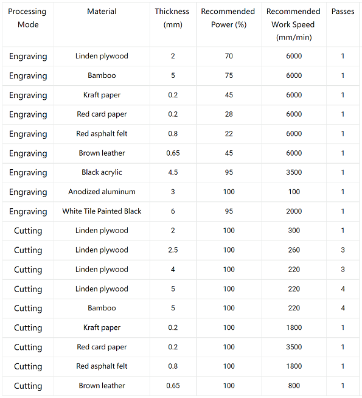

# Recommended parameters

## Notes

1.Please ensure that the focal length of the laser module is correct and the lens of the laser module is clean when powered off(It can be clean with the dustless cloth and alcohol).

2.The parameters are for reference only because the color of the material is different and it will lead to a different effect.You can achieve adesired effect by adjusting the parameters: Generally higher power or slower speed make deeper effect; Lower power or faster speed make shallower effect.

3.The bottom surface of the cutting place should be suspended when cutting.You should protect the workbench (such as using steel plates or other materials that are not easily penetrated by laser).

Recommended setting parameters for laser engraving/cutting

