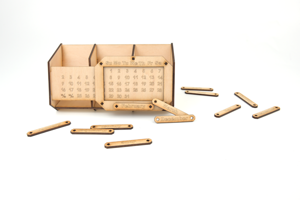
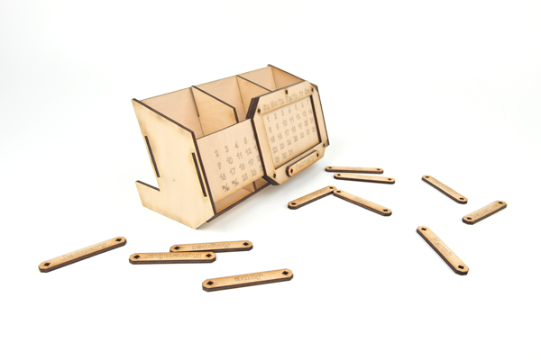

# Case 05: The Calendar

## Introduction

The calendar is a publication for daily use, recording dates and other relevant information.
The creative combination of calendar and pen holder is not only practical but also saves space on the desktop.

## Materials Required

[TOOCA laser 1](https://www.elecfreaks.com/elecfreaks-tooca-laser-1.html)

3mm Plywood

## Relevant parameters

|Model|TOOCA Laser 1|
|:-------:|:-------:|
|Material of consumables|Basswood board|
|Thickness|2.8mm|
|Power|100%|
|Speed|240mm/min|
|Times required to be engraved/cut|3|

Note: This case takes a 2.8mm basswood board as an example. If you need to use different thicknesses or use different materials, please modify the drawing by yourself and refer to the `Recommended parameter` modify the parameters of the software.

## Drawings download link

[Calendar.dxf](https://github.com/elecfreaks/learn-en/raw/master/tooca-laser-1/file/calendar.dxf.zip)

## Effect Show

## material data

More detail about the material：[laser cutting material](https://elecfreaks.com/download/tooca-laser/Cutting.zip)，[Laser engraving material](https://elecfreaks.com/download/tooca-laser/engraving.zip)

Welcome to join the [Laser Engraving Cutter Creative Sharing Community](https://www.facebook.com/groups/1152321032019436/) to share your creativity.

