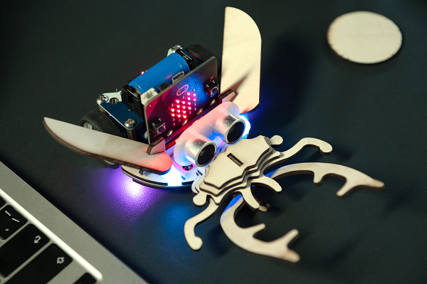
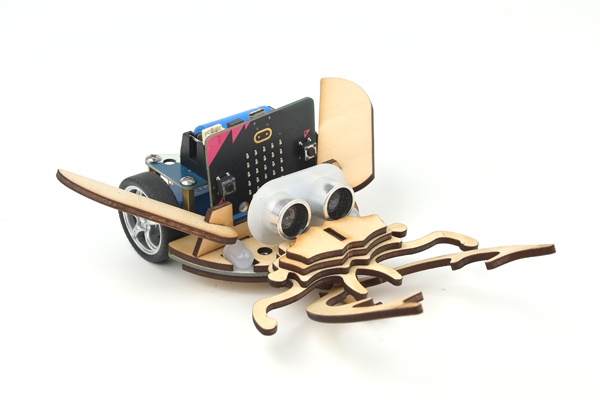
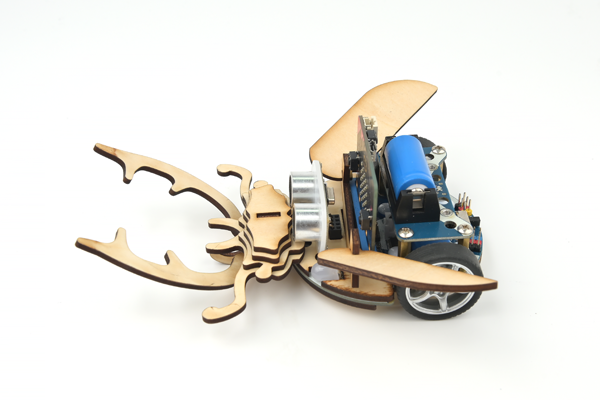
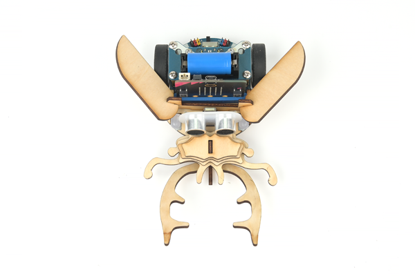

# Case 09: The Cutebot Unicorn

## Introduction

The unicorn appears in large numbers in June to August, with a tendency to light, mostly day and night, often gathered in the daytime at the sap flow of green oak, or in the light wax trees also often appear to gather hundreds of unicorns, at night, in mountainous areas with street lights, can often find their traces. They mainly feed on the sap of tree wounds, or ripe fruit, and basically do not cause harm to crops and trees.

## Materials Requested

[TOOCA laser 1](https://www.elecfreaks.com/elecfreaks-tooca-laser-1.html)

[Smart Cutebot Kit](https://www.elecfreaks.com/micro-bit-smart-cutebot.html)

3mm Plywood

## Relevant parameters

|Model|TOOCA Laser 1|
|:-------:|:-------:|
|Material of consumables|Basswood board|
|Thickness|2.8mm|
|Power|100%|
|Speed|240mm/min|
|Times required to be engraved/cut|3|

Note: This case takes a 2.8mm basswood board as an example. If you need to use different thicknesses or use different materials, please modify the drawing by yourself and refer to the `Recommended parameter` modify the parameters of the software.

## Drawings Download Link

[Cutebot Unicorn.dxf](https://github.com/elecfreaks/learn-en/raw/master/tooca-laser-1/file/Cutebot-Unicorn.dxf.zip)

## Effect Show

## material data

More detail about the material：[laser cutting material](https://elecfreaks.com/download/tooca-laser/Cutting.zip)，[Laser engraving material](https://elecfreaks.com/download/tooca-laser/engraving.zip)
