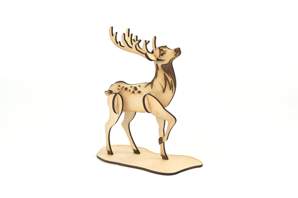

# Case 03: The Elk

## Introduction

The elk is a large herbivore with a black longitudinal stripe on the back of the neck and a brownish-white belly and rump, and after September the body fur is replaced by a longer, thicker gray winter coat.

## Materials used

[TOOCA laser 1](https://shop.elecfreaks.com/products/elecfreaks-tooca-laser-1?_pos=1&_sid=d04f6dda2&_ss=r)

3mm plywood

## Relevant parameters

|Model|TOOCA Laser 1|
|:-------:|:-------:|
|Material of consumables|Basswood board|
|Thickness|2.8mm|
|Power|100%|
|Speed|240mm/min|
|Times required to be engraved/cut|3|

Note: This case takes a 2.8mm basswood board as an example. If you need to use different thicknesses or use different materials, please modify the drawing by yourself and refer to the `Recommended parameter` modify the parameters of the software.

## Drawings download link

[Elk.dxf](https://github.com/elecfreaks/learn-en/raw/master/tooca-laser-1/file/Elk.dxf.zip)

## Effect show

## material data

More detail about the material：[laser cutting material](https://elecfreaks.com/download/tooca-laser/Cutting.zip)，[Laser engraving material](https://elecfreaks.com/download/tooca-laser/engraving.zip)

Welcome to join the [Laser Engraving Cutter Creative Sharing Community](https://www.facebook.com/groups/1152321032019436/) to share your creativity.
