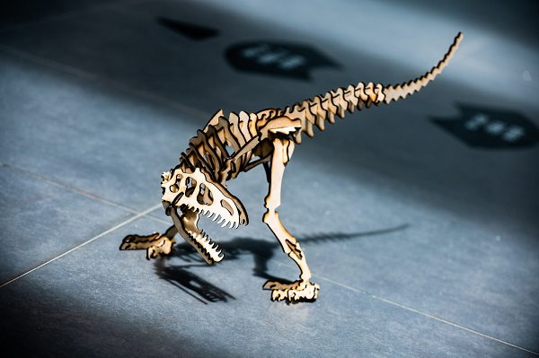
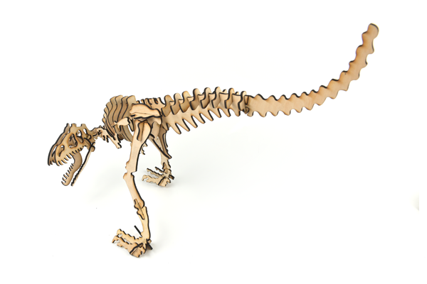
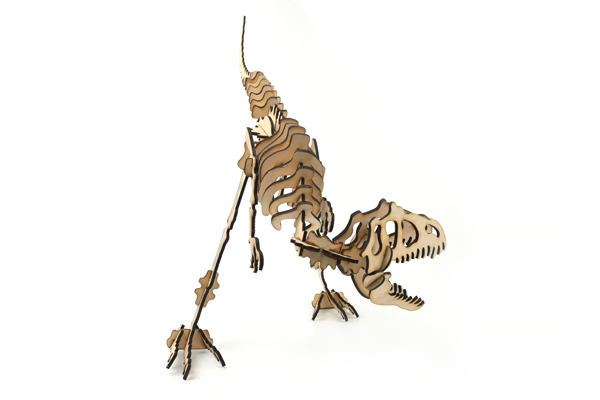
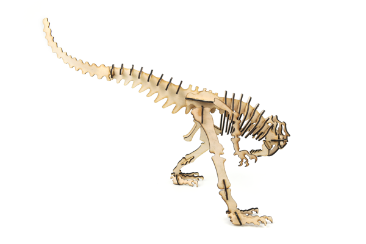
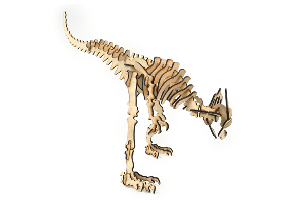
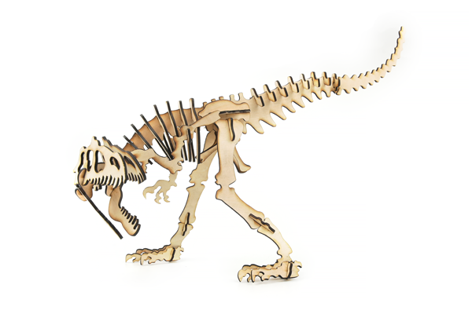

# Case 07: Tyrannosaurus Rex

## Introduction

The tyrannosaurus rex, or Rex Tyrannosaurus, survived in the Maastrichtian (MAA) period at the end of the Cretaceous about 68.5 to 65 million years ago at the very end of the Cretaceous and was one of the last non-avian species of the dinosaur before the Cretaceous-Tertiary extinction event. Fossils are found in the United States and Canada in North America, and it is one of the most recently extinct dinosaurs. Make a Tyrannosaurus Rex assembled model with a laser cutter.

## Materials Requested

[TOOCA laser 1](https://shop.elecfreaks.com/products/elecfreaks-tooca-laser-1?_pos=1&_sid=d04f6dda2&_ss=r)

3mm Plywood

## Relevant Parameters

|Model|TOOCA Laser 1|
|:-------:|:-------:|
|Material of consumables|Basswood board|
|Thickness|2.8mm|
|Power|100%|
|Speed|240mm/min|
|Times required to be engraved/cut|3|

Note: This case takes a 2.8mm basswood board as an example. If you need to use different thicknesses or use different materials, please modify the drawing by yourself and refer to the `Recommended parameter` modify the parameters of the software.

## Drawings Download Link

[Tyrannosaurus rex.dxf](https://github.com/elecfreaks/learn-en/raw/master/tooca-laser-1/file/Tyrannosaurus-Rex.dxf.zip)

## Effect Show

## material data

More detail about the material：[laser cutting material](https://elecfreaks.com/download/tooca-laser/Cutting.zip)，[Laser engraving material](https://elecfreaks.com/download/tooca-laser/engraving.zip)

Welcome to join the [Laser Engraving Cutter Creative Sharing Community](https://www.facebook.com/groups/1152321032019436/) to share your creativity.
