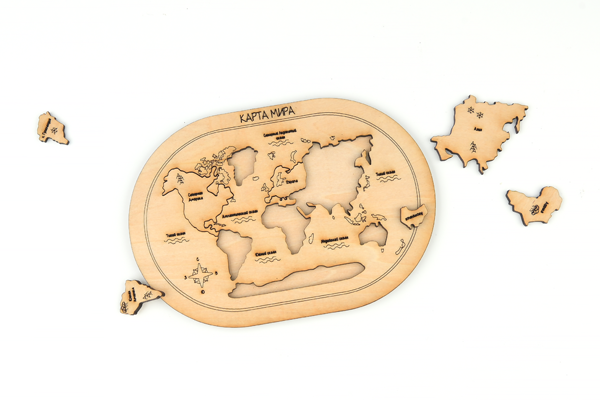

# Case 02: The World Map
## Introduction

The World Map (The World Map) is a map depicting the entire surface of the earth, usually with topography, latitude and longitude lines, and other data such as place names, etc. Users can use the latitude and longitude lines to find out the specific location of each place on the world map, so as to understand the whole world. There are various ways to project the earth's surface onto a flat surface. Make a world map puzzle by yourself with TOOCA Laser 1.

## Materials used

[TOOCA laser 1](https://www.elecfreaks.com/elecfreaks-tooca-laser-1.html)

3mm Plywood

## Relevant parameters

|Model|TOOCA Laser 1|
|:-------:|:-------:|
|Material of consumables|Basswood board|
|Thickness|2.8mm|
|Power|100%|
|Speed|240mm/min|
|Times required to be engraved/cut|3|

Note: This case takes a 2.8mm basswood board as an example. If you need to use different thicknesses or use different materials, please modify the drawing by yourself and refer to the `Recommended parameter` modify the parameters of the software.

## Drawings download link

[The World Map.dxf](https://github.com/elecfreaks/learn-en/raw/master/tooca-laser-1/file/world-map-puzzle.dxf.zip)

## Effect show

## material data

More detail about the material：[laser cutting material](https://elecfreaks.com/download/tooca-laser/Cutting.zip)，[Laser engraving material](https://elecfreaks.com/download/tooca-laser/engraving.zip)

